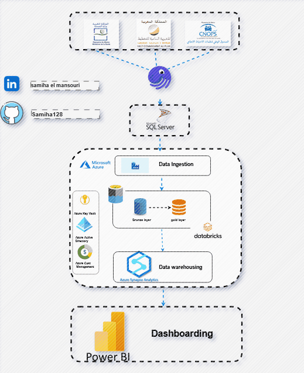
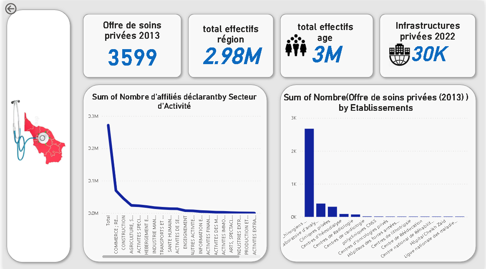

# Health-Situation-in-Morocco

## Table of Contents 📋
- [Overview](#overview)
- [Installation](#installation)
- [Usage](#usage)
- [Difficulties](#difficulties)
- [Points to Improve](#points-to-improve)
- [Tools](#tools)
- [Architecture](#architecture)
- [Dashboard](#dashboard)
- [Contact](#contact)

## 🚀 Overview

The **Health-Situation-in-Morocco** project focuses on analyzing the private healthcare sector in Morocco. This project aims to provide a comprehensive assessment of various health infrastructure indicators across different regions of the country. Key aspects of the analysis include:

- **Number of Clinics per Region**: Evaluating the distribution of private clinics across various regions.
- **Number of Doctors**: Analyzing the availability of doctors in different areas.
- **Affiliates' Declarations**: Examining data related to the declarations made by affiliates, including health insurance claims and coverage details.
- **Number of Pensioned Insured Individuals**: Tracking the count of insured individuals who are currently receiving pensions.
- **Declared Payroll**: Assessing the reported payroll for healthcare employees within the private sector.
- **Population per Primary Healthcare Facility**: Calculating the number of residents served by each basic healthcare facility.
- **Population per Nurse**: Evaluating the ratio of residents to nurses to gauge healthcare accessibility.
- **Evolution of Primary Healthcare Facilities**: Monitoring the growth and changes in primary healthcare establishments over time.


##  🛠️ Installation

To set up the project locally, follow these steps:

1. **Clone the Repository**:

    ```bash
    git clone https://github.com/Samiha128/Health-Situation-in-Morocco.git
    ```
2. **Navigate to the Project Directory**:

    ```bash
    cd Health-Situation-in-Morocco
    ```

3. **Install Dependencies for Dagster**:

    This project uses Dagster for data orchestration. Ensure you have an account with Azure, SQL Server, and Power BI as these services are required for the project's full functionality.

    - **Install Dagster**:

        ```bash
        pip install dagster dagit  # Install Dagster and Dagit for development
        ```

4. **Configure Azure, SQL Server, and Power BI**:

    - **Azure**: Set up an Azure account and configure your resources according to your project needs. Ensure you have access to necessary Azure services.

    - **SQL Server**: Configure SQL Server and provide the connection details in the project's configuration files.

    - **Power BI**: Set up Power BI and configure it for data visualization as needed by the project.
      
  ## Usage 🔍

The **Health-Situation-in-Morocco** project is designed to provide valuable insights into the healthcare sector in Morocco, with comparisons to other countries. Here’s how this project can be useful:

- **Assessment of Healthcare Levels in Morocco**: The project helps understand the state of the healthcare sector in Morocco by providing detailed data on the number of existing hospitals, as well as the growth rate of these facilities over time.

- **Regional Analysis of Doctors**: It allows for examining the distribution of doctors across different regions of Morocco, providing an overview of medical access on a regional scale.

- **International Comparison**: Although the project primarily focuses on Morocco, the collected and analyzed data can be used to compare Morocco’s healthcare situation with that of other countries. This includes comparing hospital infrastructure and medical resources available relative to other regions.

- **Tracking the Evolution of Medical Resources**: The project enables tracking the evolution of the number of hospitals and doctors over time, providing key indicators to assess the improvement or deterioration of healthcare services in the country.


## Difficulties ⚠️

The **Health-Situation-in-Morocco** project has faced several challenges during its development. Some of the key difficulties include:

- **Cloud-Based Development**: The project is developed in a cloud environment, which has introduced complexities in managing and analyzing data. Working in the cloud requires careful handling of cloud-specific tools and configurations, which can sometimes complicate the development process.

- **Incomplete Sharing of Project Process**: One significant challenge has been the partial sharing of the project process. Certain aspects of the project's development and workflow have not been fully documented or shared, which can create difficulties in understanding and replicating the process. This lack of comprehensive documentation can hinder collaboration and make it challenging for new contributors to get up to speed.
## Points to Improve

- **Use of Verified Data**: Ensure that the project relies solely on verified open-source data from reputable sources such as the Ministry of Health, HCP, and CNOPS. This will enhance the accuracy of the analysis and prevent reliance on unverifiable data sources.
## 🛠 Tools

- **Dagster** 
- **SQL Server**
- **Azure Portal**
  - **Azure Data Factory**
  - **Databricks (PySpark)**
  - **Azure Data Lake Storage Gen2**
  - **Azure Synapse Analytics**
- **Power BI**
## 🏗️ Architecture
```
Health-Situation-in-Morocco
│ README.md
│
├── data
│ ├── Effectif des assurés actifs par Tranche d'âge.csv
│ ├── Health in Morocco_wikipedia.csv
│ ├── Indicateurs sur les déclarations de salaires CNSS effectuées au titre de l'année 2020 (cnss).csv
│ ├── Suicide deaths.csv
│ ├── calcule.csv
│ ├── indic-soc-sante-mef-2014-3 MEF.csv
│ ├── indicateur-sur-la-repartition-des-affilies-par-region.csv
│ ├── indicateur-sur-la-repartition-des-affilies-par-secteur-dactivite cnss.csv
│ ├── infrastructures-privees-2022.csv
│ ├── offre-de-soins-privees-ms-2013.csv
│ └── stastique.csv
│
├── env
│ ├── .nux
│ ├── .telemetry
│ ├── Include/site/python3.12/greenlet
│ ├── Lib/site-packages
│ ├── Scripts
│ ├── history
│ ├── logs
│ ├── schedules
│ ├── storage
│ ├── dagster.yaml
│ └── pyvenv.cfg
│
├── etl
│ ├── etl
│ ├── etl_tests
│ ├── README.md
│ ├── pyproject.toml
│ ├── setup.cfg
│ ├── setup.py
│ └── stastique.csv
│
├── images
│ ├── Data-factory.png
│ ├── account storage.png
│ ├── architecture.gif
│ ├── architecture.png
│ ├── containers.png
│ ├── dagster.png
│ ├── dagsterpipeline.png
│ ├── data ingestion 1.png
│ ├── data ingestion 2.png
│ ├── datastorage.png
│ ├── df.png
│ ├── dfliason.png
│ ├── effectif total.png
│ ├── folder-2.png
│ ├── folder1.png
│ ├── health.png
│ ├── permission.png
│ ├── permission1.png
│ ├── role.png
│ └── sqlserver.png
│
├── HealthCare.pbix
├── SQLQuery1.sql
└── health.ipynb
```



##  📈 Dashboard
 - For visualizing the data and performing detailed analyses, we have utilized Power BI. This tool allows us to create interactive and insightful dashboards that provide a comprehensive view of the health data
   



## 🔗 Contact
For more information or inquiries about the project, please feel free to contact me via LinkedIn:

[](https://www.linkedin.com/in/samiha-el-mansouri-27505b250/)
